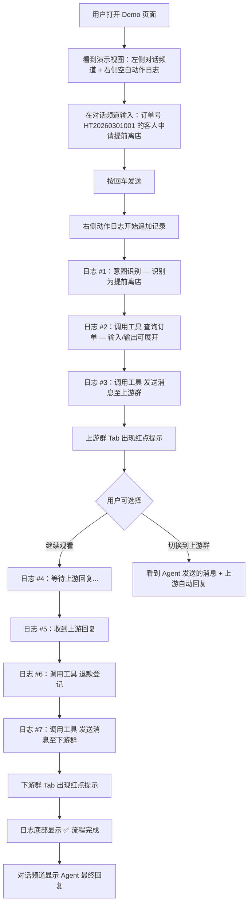
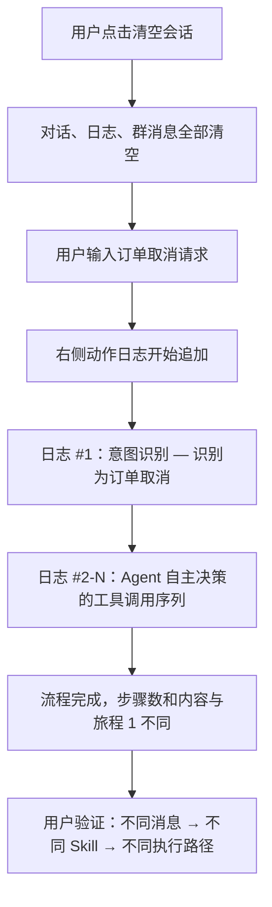
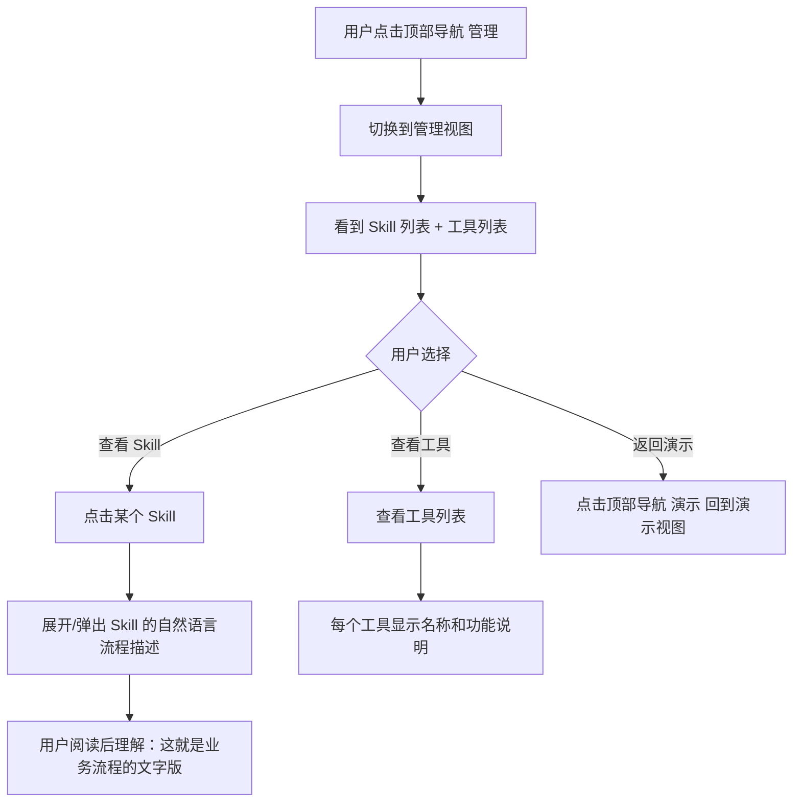
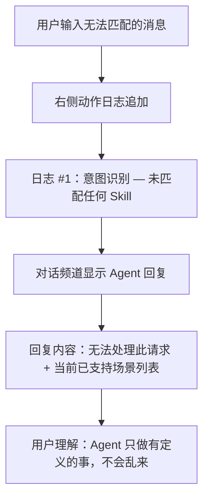

---
stepsCompleted:
  - 1
  - 2
  - 3
  - 4
  - 5
  - 6
  - 7
  - 8
  - 9
  - 10
  - 11
  - 12
  - 13
  - 14
inputDocuments:
  - prd.md
  - prd-validation-report.md
---

# UX Design Specification AI_coding_demo

**Author:** Admin
**Date:** 2026-02-26

---

<!-- UX design content will be appended sequentially through collaborative workflow steps -->

## Executive Summary

### Project Vision

AI Agent 客服自动化演示系统——面向酒店/OTA 行业客服管理层和业务决策者的交互式 Demo。核心目标是通过可视化、可运行的演示，证明 AI Agent 能替代人工完成端到端客服操作流程。系统内部模拟企微群聊和业务系统，无需外部依赖，开箱即可演示。

UX 设计的核心使命：让非技术背景的业务决策者在 5 分钟内直观理解"AI 能做事而不仅仅是回答问题"。

### Target Users

**主要用户：客服团队管理层**
- 典型人物：李姐，客服团队主管，管理 15 人团队
- 技术水平：非技术背景，熟悉日常业务操作流程
- 核心痛点：团队在企微群和多个业务系统之间反复切换、复制粘贴，大量重复劳动
- 期望：看到 AI 能真正"做事"——执行实际操作而不是聊天回答问题
- 使用环境：桌面浏览器（Chrome/Edge），本地 Demo，可能用于会议室投屏演示或个人体验

### Key Design Challenges

1. **复杂流程的可理解性** — Agent 执行多步骤工作流（意图识别 → Skill 加载 → 多次工具调用 → 结果返回），需让非技术用户一眼看懂每一步在做什么，避免被技术细节淹没
2. **实时过程展示的节奏感** — 逐步展示需要恰当的视觉节奏和清晰的时序层次，让用户跟得上又不失耐心
3. **Demo 感与真实感的平衡** — 全模拟环境需要让观看者相信架构可直接对接真实系统，UI 需展示能力而不过度包装

### Design Opportunities

1. **"Agent 在做事"的沉浸式体验** — 通过可视化面板让用户仿佛旁观一个高效客服在操作，每一步透明可追踪
2. **Skill 的直觉性展示** — 管理页面用自然语言展示 Skill 流程，让非技术用户理解"这个我也能写/改"，增强产品说服力
3. **对比叙事** — 通过 UI 设计隐含传达"人工多步切换"vs"Agent 自动完成"的效率差异

## Core User Experience

### Defining Experience

核心体验循环：**输入 → 观看 → 理解**。用户在输入框输入一条客服消息，按下发送，然后观看可视化面板像讲故事一样逐步展开 Agent 的每一个工作步骤。

产品的决定性交互是"工作流可视化面板的逐步展开"——这是整个 Demo 的灵魂。用户能否一眼看懂 Agent 每一步在做什么，直接决定了 Demo 的成败和说服力。

### Platform Strategy

- 纯 Web SPA，桌面浏览器（Chrome/Edge）
- 鼠标/键盘交互为主
- 本地运行（localhost），无需离线支持
- 针对 1280px+ 宽屏优化，无需响应式适配
- 考虑投屏演示场景：较大字体、高对比度、清晰的视觉层次

### Effortless Interactions

| 交互 | 设计目标 |
|------|---------|
| 发送消息 | 打字 + 回车，零学习成本，像发微信一样自然 |
| 理解每一步 | 可视化面板使用业务语言（"查询订单"、"通知上游"），而非技术术语 |
| 切换场景 | 一键清空会话，立即开始新一轮演示 |
| 视图切换 | 演示视图与管理视图之间的切换直觉化 |
| 上游回复 | 自动模拟生成，用户无需手动触发 |

### Critical Success Moments

1. **"原来 AI 是这样做事的"** — 可视化面板首次完整展开，用户理解 Agent 是在"操作"而非"聊天"
2. **"这和我们每天干的事一模一样"** — 流程步骤与真实客服工作完全对应（查订单 → 通知上游 → 等回复 → 退款 → 回复下游）
3. **"换一条消息试试"** — 用户主动尝试不同场景，发现 Agent 自动走不同流程，验证架构通用性
4. **"这个 Skill 我看得懂"** — 管理页面展示自然语言流程描述，非技术用户意识到自己也能参与维护

**失败时刻：** 可视化面板更新太慢/跳步导致用户跟不上，或某一步描述不可理解导致信任链断裂。

### Experience Principles

1. **透明即信任** — 每一步操作清晰可见、可理解，透明度是建立对 AI 信任的唯一路径
2. **业务语言优先** — 所有界面文案和步骤描述使用业务语言而非技术术语，非技术用户零障碍理解
3. **观看即理解** — 可视化面板像"讲故事"一样展开，用户只需观看就能理解完整流程，无需额外解释
4. **一键即演** — 从打开页面到完成一次完整演示，操作步骤最少化，演示者随时可以自信展示

## Desired Emotional Response

### Primary Emotional Goals

本产品是**说服性演示**，情感设计核心不是"效率感"而是"被打动"：

1. **恍然大悟** — "原来 AI 是这样替我们干活的"——理解 Agent 工作方式的顿悟时刻
2. **信任与掌控** — "每一步我都看得懂，AI 没有在乱来"——透明度带来的安全感
3. **兴奋与可能性** — "如果这个能接上真实系统..."——对未来落地的期待和想象空间

### Emotional Journey Mapping

| 阶段 | 用户行为 | 期望情感 |
|------|---------|---------|
| 首次打开 | 看到界面 | 好奇 — "让我试试" |
| 输入消息 | 打字、发送 | 期待 — "它会怎么处理？" |
| 观看流程展开 | 看可视化面板 | 惊叹 → 理解 — "原来是这样！" |
| 流程完成 | 看到最终结果 | 信服 — "整个流程真的做完了" |
| 尝试第二场景 | 输入不同消息 | 验证感 — "架构确实是通用的" |
| 查看管理页面 | 浏览 Skill/工具 | 掌控感 — "这个我看得懂" |
| 测试边界 | 输入无效消息 | 安心 — "AI 不会乱来" |

### Micro-Emotions

**关键情感轴（期望 → 避免）：**
- 信任 → 怀疑：每一步透明展示积累信任，任何"黑盒"感触发怀疑
- 惊喜 → 焦虑：流程展开应带来"哇"而非"怎么回事？"
- 成就 → 挫败：首次使用即成功完成完整演示，零失败容忍度
- 掌控 → 失控：用户始终感到"我在主导演示"而非"系统在自己跑"

**必须避免的情感：** 困惑（看不懂某步）、不耐烦（等太久）、不信任（怀疑预设）、无聊（缺乏惊喜）

### Design Implications

| 期望情感 | UX 设计策略 |
|---------|-----------|
| 好奇 → 期待 | 简洁首屏，输入框居中突出，暗示"试试看" |
| 惊叹 → 理解 | 可视化面板逐步动画展开，图标+标题+详情的清晰层次 |
| 信任 | 每一步展示输入和输出具体内容，不隐藏中间过程 |
| 掌控感 | 清空/重试按钮始终可见，用户随时可重新开始 |
| 安心 | 无法匹配时提示温和明确，展示已支持场景列表 |
| 兴奋与可能性 | 管理页面展示 Skill 可扩展性 |

### Emotional Design Principles

1. **信任通过透明建立** — 不隐藏任何步骤，不省略任何中间结果，用完整的信息链条让用户自己得出"可信"的结论
2. **惊叹来自节奏** — 可视化展开的节奏决定了"哇"还是"啊？"，每一步出现的时机和动画需要精心编排
3. **掌控感是安全网** — 清空、重试、切换视图等操作始终可达，让用户知道自己随时可以"重来"
4. **好奇心是最好的引导** — 不需要教程或引导文案，简洁的界面自然引发"试试看"的冲动

## UX Pattern Analysis & Inspiration

### Inspiring Products Analysis

**Manus（AI Agent 全流程可视化）**
- 左右分屏布局：对话区 + Agent 实时工作面板
- 步骤流以时间线逐步展开，用人类可理解的动作描述
- 过程与结果并存，边做边看，传递"AI 在做事"的实感
- 操作粒度适中，不暴露底层技术细节

**ChatGPT 思考过程展示**
- 折叠式思考，默认不干扰主体验，想看细节可展开
- 渐进式信息披露，满足不同用户的信息需求深度
- 打字机效果传递"正在生成"的真实感

**LangSmith / LangGraph Studio**
- 树形/流程图展示 Agent 调用链，每个节点可展开查看详情
- 时间线标注执行耗时
- 偏技术向，对非技术用户过于复杂（反面参考）

### Transferable UX Patterns

**布局模式：**
- 左右分屏（借鉴 Manus）— 左侧消息输入/对话区，右侧 Agent 工作流可视化面板
- 时间线式步骤流（借鉴 Manus + ChatGPT）— 纵向时间线逐步展开

**交互模式：**
- 渐进式信息披露（借鉴 ChatGPT）— 默认"步骤标题 + 状态"，点击展开输入/输出详情
- 实时状态动画（借鉴 Manus）— 执行中步骤有 loading 动画，已完成显示勾号
- 消息式输入（借鉴微信/ChatGPT）— 底部输入框，回车发送，利用用户已有肌肉记忆

**视觉模式：**
- 状态色彩系统 — 执行中（蓝色/动画）、成功（绿色/勾号）、失败（红色/叹号）
- 图标化步骤类型 — 不同操作类型使用不同图标，增强可识别性

### Anti-Patterns to Avoid

1. **技术术语轰炸** — 避免 JSON 格式的原始输入/输出，工具调用参数应翻译成业务语言
2. **信息一次性倾泻** — 避免所有步骤同时出现，必须按时间顺序逐步展开
3. **纯文字墙** — 避免无视觉层次的纯文本描述，需要图标、色彩、层级区分
4. **过度动画** — 避免炫酷动效分散注意力，Demo 追求"专业清晰"而非"视觉炫技"

### Design Inspiration Strategy

**采纳（Adopt）：**
- Manus 的左右分屏布局 — 完美契合"消息输入 + 流程可视化"的核心体验
- ChatGPT 的渐进式信息披露 — 平衡"一目了然"和"深入查看"的需求
- 消息式输入交互 — 零学习成本，用户已有肌肉记忆

**适配（Adapt）：**
- Manus 的步骤流展示 — 简化为纯业务语言描述，去除技术细节，适配非技术用户
- LangSmith 的节点展开 — 保留"点击查看详情"的交互，但详情内容用业务语言呈现而非 JSON

**避免（Avoid）：**
- LangSmith 的技术化呈现方式 — 与非技术目标用户不匹配
- 纯终端/控制台风格的输出展示 — 暗示"这是开发工具"而非"这是业务工具"

## Design System Foundation

### Design System Choice

**选定方案：Ant Design（React）**

基于 Web SPA 桌面应用、单人开发、PoC Demo 快速交付、面向业务决策者的项目特征，选择 Ant Design 作为设计系统基础。

### Rationale for Selection

1. **开发效率最优** — 单人开发场景下，Ant Design 的 Timeline、Steps、Card、Collapse 组件几乎可直接用于工作流可视化面板，无需从零构建
2. **调性契合** — 企业级设计语言传递"专业可靠"的信号，与 Demo 面向业务决策者的定位一致
3. **中文生态** — 文档、社区、示例全面中文化，开发体验最佳
4. **低定制成本** — 默认主题已足够专业，只需微调配色即可满足需求

### Implementation Approach

**核心组件映射：**

| 功能需求 | Ant Design 组件 |
|---------|----------------|
| 工作流步骤展示 | Timeline + 自定义节点 |
| 步骤详情展开/收起 | Card + Collapse |
| 左右分屏布局 | Layout（Sider + Content） |
| 消息输入 | Input + Button |
| Skill/工具列表 | Table 或 List |
| Skill 内容查看 | Modal 或 Drawer |
| 状态指示 | Tag + Badge + Spin |
| 视图切换 | Menu 或 Tabs |

### Customization Strategy

- 使用 ConfigProvider 统一配色（蓝色系主色调，传递科技感和信任感）
- Timeline 组件自定义 dot 图标，区分不同操作类型（查询、发消息、等待、登记）
- Card 组件自定义样式，匹配步骤状态色彩系统（执行中蓝色、成功绿色、失败红色）
- 整体保持 Ant Design 默认风格，仅做主题色和间距微调，避免过度定制

## Defining Experience

### The Core Interaction

> **"打一条消息，看 AI 一步步替你把活干完"**

用户发送一条客服消息，然后亲眼看到 Agent 像一个高效客服一样逐步执行完整工作流——全程透明，每一步清清楚楚。这是产品的灵魂交互，做到极致则一切跟上。

### User Mental Model

**用户当前认知：**
- "客服工作 = 在多个窗口之间来回切换、复制粘贴"
- "AI 机器人 = 只会回答知识库问题"（需要打破的固有认知）
- "自动化 = 我看不懂的黑盒"（需要避免触发的心理）

**设计对策：**
- 将技术概念翻译为业务语言："意图识别" → "Agent 判断这是一个'提前离店'请求"
- 将工具调用翻译为操作动作："调用订单查询工具" → "Agent 正在查询订单"
- 用户应感觉像"看着一个同事在操作"，而非"看着一个程序在运行"

### Success Criteria

1. **即时可理解** — 用户看到第一个步骤展开时，3 秒内理解 Agent 在做什么
2. **流程可预期** — 到第二、三步时，用户开始能预判"下一步应该是..."
3. **结果可确认** — 流程结束时，用户清楚知道"做完了，结果是..."
4. **无需解释** — 全程无需旁人解释，界面本身说明一切

### Novel UX Patterns

**模式策略：组合熟悉模式，创新性呈现**

| 熟悉模式 | 来源 | 在本产品中的应用 |
|---------|------|----------------|
| 消息输入 | 微信/ChatGPT | 左侧对话区底部输入框 |
| 步骤展开 | 快递追踪/订单状态 | 右侧时间线逐步展开工作流 |
| 详情查看 | 各类 App 的折叠面板 | 点击步骤节点展开输入/输出详情 |

创新点在于组合：输入消息 → 触发时间线式工作流展开 → 每步可查看细节。用户无需学习新交互，组合体验却是全新的。

### Experience Mechanics

**1. 启动（Initiation）：**
- 简洁输入框占据左侧面板底部
- Placeholder 示例："输入客服消息，例如：订单号 HT20260301001 的客人申请提前离店"
- 右侧面板空白或欢迎提示，暗示"这里将展示 Agent 工作过程"

**2. 交互（Interaction）：**
- 用户打字 → 回车/点击发送
- 消息以气泡形式出现在左侧对话区
- 右侧面板立即展示第一步："正在分析消息意图..."

**3. 反馈（Feedback）：**
- 每一步以时间线节点出现：状态图标 + 步骤标题 + 可展开详情
- 执行中 = 旋转动画 + 蓝色高亮，完成 = 绿色勾号 + 轻微淡化
- 步骤间短暂停顿（~500ms），让用户消化信息后再展示下一步

**4. 完成（Completion）：**
- 时间线底部显示"流程完成"标记
- 左侧对话区出现 Agent 最终回复消息
- 用户可输入新消息继续，或点击"清空会话"重新演示

## Visual Design Foundation

### Color System

**主色调：科技蓝（#1677FF — Ant Design 默认主色）**
传递专业、信任、科技感，企业级产品最安全的色彩选择。

**语义色彩映射：**

| 语义 | 色值 | 用途 |
|------|------|------|
| Primary | #1677FF（蓝） | 主要操作、当前步骤、导航高亮 |
| Success | #52C41A（绿） | 步骤完成、流程成功 |
| Processing | #1677FF + Spin | 当前执行中的步骤 |
| Warning | #FAAD14（橙） | 等待状态 |
| Error | #FF4D4F（红） | 步骤失败、错误提示 |
| Neutral | #8C8C8C（灰） | 辅助文字、未开始步骤 |

**背景层次：**

| 层级 | 色值 | 用途 |
|------|------|------|
| 页面背景 | #F5F5F5 | 整体底色 |
| 面板背景 | #FFFFFF | 左右主面板 |
| 已完成步骤 | #FAFAFA | 时间线中已完成步骤背景 |
| 当前步骤 | #E6F4FF | 当前执行步骤高亮 |

### Typography System

**字体：** 跟随 Ant Design 系统字体栈，无外部字体依赖

**字号层级（投屏友好，整体偏大）：**

| 层级 | 字号 | 字重 | 用途 |
|------|------|------|------|
| 页面标题 | 24px | 600 | 系统标题 |
| 区域标题 | 18px | 600 | 面板标题 |
| 步骤标题 | 16px | 500 | 工作流步骤名称 |
| 正文 | 14px | 400 | 步骤详情、消息内容 |
| 辅助文字 | 12px | 400 | 时间戳、状态标签 |

行高统一 1.5 倍，确保中文阅读舒适度。

### Spacing & Layout Foundation

**间距基准：8px 倍数体系**（8/16/24/32/48px）

**整体布局：**
- 顶部导航栏：56px 高度，包含视图切换和操作按钮
- 左侧消息面板：35% 宽度，对话区 + 底部输入框
- 右侧可视化面板：65% 宽度，Agent 工作流时间线
- 面板内边距：24px
- 页面背景与面板形成层次区分

**布局原则：**
- 右侧面板占大空间 — 工作流可视化是核心
- 左侧面板轻量 — 消息输入是触发器
- 投屏友好 — 字号偏大、间距充足、对比清晰

### Accessibility Considerations

- 文字色彩对比度 ≥ 4.5:1（WCAG AA）
- 状态区分不仅依赖颜色，同时使用图标（勾号/旋转/叹号）
- 可点击元素最小 32px 点击区域
- Demo 阶段不追求完整 WCAG 合规，但以上基础原则零成本遵守

## Design Direction Decision

### Design Directions Explored

基于项目需求生成了 6 个设计方向（详见 `ux-design-directions.html`）：
1. 简洁时间线（左右分屏 + 纵向时间线）
2. 卡片步骤（独立卡片 + 左侧色条）
3. 故事叙述（大号数字 + 详细描述）
4. 紧凑专业（深色导航 + 统计摘要 + 表格）
5. 暗色科技（GitHub 风格深色主题）
6. 居中聚焦（卡片悬浮居中）

### Chosen Direction

**选定方案：方案 1 简洁时间线（经修正）**

选择方案 1 作为基础，但针对两个关键设计偏差进行了修正：

**修正 1：Agent 动作日志而非预设流程图**
原设计将右侧面板设计为预定义步骤的 pipeline（包含"待执行"步骤），这是错误的。Agent 的每一步是 AI 实时决策的结果，不是预定义流程。

修正后：右侧面板是**实时动作日志**——只展示已完成和正在执行的动作，按时间顺序向下追加。不展示任何"待执行"步骤，因为下一步是什么取决于 Agent 的实时决策。新动作出现时带入场动画，自动滚动到底部。

**修正 2：三频道消息系统**
原设计只有单一消息区，但实际业务涉及三方通信。

修正后：左侧面板顶部设置三个频道 Tab：
- **对话** — 操作者与 Agent 的直接交互（主聊天框，用户在此输入消息、查看 Agent 回复）
- **下游群** — 只读旁观，展示 Agent 代为发送/接收的下游企微群消息
- **上游群** — 只读旁观，展示 Agent 与上游供应商的消息往来

当 Agent 在某个群发送或接收消息时，对应 Tab 显示红点/未读提示，引导用户切换查看。

### Design Rationale

1. **方案 1 为基础** — 左右分屏 + 时间线是最接近 Manus 的成熟模式，Ant Design Timeline 组件可直接使用
2. **动作日志替代流程图** — 忠实反映 Agent 的自主决策特性，不误导用户以为流程是固定的
3. **三频道设计** — 完整呈现信息在操作者、下游、上游三方之间的流转，让用户理解 Agent 如何在多方之间协调
4. **红点提示** — 低成本的注意力引导，用户自然会好奇"上游群发生了什么"而主动切换查看

### Implementation Approach

**修正后布局结构：**

```
┌──────────────────────────────────────────────────┐
│  顶部导航栏 (56px)  [演示] [管理] [历史]  [清空] │
├──────────────────────┬───────────────────────────┤
│ [对话] [下游群●] [上游群] │  Agent 实时动作日志   │
│ ─────────────────────── │                       │
│                         │  ● 意图识别            │
│  "对话"频道：            │  │ 识别为"提前离店"     │
│  ┌──────────┐           │  │                     │
│  │用户：订单号│           │  ● 调用工具：查询订单  │
│  │HT2026... │           │  │ 输入：HT20260301001 │
│  │申请提前离店│           │  │ 返回：SUP-88901    │
│  └──────────┘           │  │                     │
│  ┌──────────┐           │  ● 调用工具：发送消息   │
│  │Agent：已收│           │  │ 目标：上游群         │
│  │到，正在处理│           │  │ 内容：SUP-88901... │
│  └──────────┘           │  │                     │
│                         │  ◉ 正在思考下一步...    │
│  ┌────────────┐         │  （无预设待执行步骤）   │
│  │ 输入框  [发]│         │                        │
│  └────────────┘         │                        │
├─────────────────────────┴────────────────────────┤
```

**三频道行为：**

| 频道 | 可写 | 内容 |
|------|------|------|
| 对话 | ✅ 用户可输入 | 操作者与 Agent 的直接交互 |
| 下游群 | ❌ 只读 | Agent 代发/代收的下游消息 |
| 上游群 | ❌ 只读 | Agent 与上游供应商的消息 |

**动作日志行为：**
- 每条记录 = 一次 Agent 动作（意图识别、工具调用、消息发送、决策等）
- 只展示已发生的动作，不预测未来步骤
- 每条记录包含：状态图标 + 动作标题 + 可展开详情
- 新动作追加到底部，带入场动画，自动滚动

## User Journey Flows

### 旅程 1：完整流程演示（提前离店）



**关键交互细节：**
- 用户全程只需做一件事：输入消息并发送
- 右侧动作日志逐条追加，每条间隔 ~500ms 带入场动画
- 当 Agent 在上游群/下游群发消息时，对应 Tab 闪烁红点
- 用户随时可切换频道查看群消息，不影响右侧日志继续更新
- 日志中每条记录默认折叠详情，点击可展开查看输入/输出

### 旅程 2：不同场景验证（订单取消）



**关键交互细节：**
- "清空会话"按钮一键重置所有状态
- 用户肉眼对比：同样的界面，不同的输入，Agent 走了完全不同的路径
- 动作日志的条目数量和内容完全由 Agent 实时决定

### 旅程 3：管理视角



**关键交互细节：**
- 管理视图替换整个主内容区（非弹窗），顶部导航保持
- Skill 列表使用 Ant Design Table 或 List 组件
- Skill 内容查看使用 Drawer（侧拉抽屉）或 Modal
- 工具列表使用 Table/List，显示工具名称 + 说明 + 参数描述

### 旅程 4：异常情况



**关键交互细节：**
- 未匹配时右侧日志只有 1 条记录（意图识别失败），不会有后续工具调用
- Agent 回复中列出已支持场景，引导用户尝试有效输入
- 整个流程快速结束（<2 秒），不让用户等

### Journey Patterns

**导航模式：**
- 顶部导航固定：[演示] [管理] [历史]，一级视图切换
- 左侧频道 Tab：[对话] [下游群] [上游群]，二级频道切换

**反馈模式：**
- 动作日志实时追加 + 入场动画 = 用户感知"Agent 在做事"
- 频道 Tab 红点 = 引导注意力到新消息
- 日志记录可展开 = 渐进式信息披露

**错误处理模式：**
- Agent 工具调用失败 → 日志记录显示错误详情（红色标识）→ Agent 自主决定是否重试或终止
- 未匹配意图 → 友好提示 + 已支持场景列表
- 清空会话随时可用 → 用户始终可以"重来"

### Flow Optimization Principles

1. **最少操作** — 用户只需：输入消息 → 发送 → 观看。其余全部自动
2. **注意力引导** — 红点提示引导用户去看有新消息的频道，而非强制切换
3. **随时可重置** — 清空会话一键重来，试错零成本

## Component Strategy

### Design System Components

**Ant Design 可直接使用的组件：**

| 需求 | Ant Design 组件 | 开箱即用程度 |
|------|----------------|-------------|
| 整体布局 | Layout（Header + Sider + Content） | 直接使用 |
| 顶部导航 | Menu（horizontal mode） | 直接使用 |
| 频道 Tab 切换 | Tabs | 直接使用（需加红点 Badge） |
| 消息输入框 | Input + Button | 直接使用 |
| Skill/工具列表 | Table 或 List | 直接使用 |
| Skill 内容查看 | Drawer 或 Modal | 直接使用 |
| 状态标签 | Tag + Badge | 直接使用 |
| 加载状态 | Spin | 直接使用 |
| 清空确认 | Popconfirm | 直接使用 |
| 通知提示 | Message 或 Notification | 直接使用 |

### Custom Components

**缺口分析：** 3 个核心自定义组件

#### ActionLogItem（动作日志条目）

**用途：** 右侧动作日志面板中的每条 Agent 动作记录，Demo 的核心视觉元素。

**内容结构：**
```
┌─────────────────────────────────────┐
│ ● [状态图标]  [动作标题]    [时间戳] │
│   [动作摘要，一行文字]               │
│   ▶ 查看详情（可展开区域）           │
│   ┌─────────────────────────────┐   │
│   │ 输入：HT20260301001         │   │
│   │ 返回：供应商订单号 SUP-88901 │   │
│   └─────────────────────────────┘   │
└─────────────────────────────────────┘
```

**状态：**

| 状态 | 图标 | 背景 | 行为 |
|------|------|------|------|
| 执行中 | Spin 动画 | #E6F4FF 浅蓝 | 脉冲动画，无详情可展开 |
| 成功 | ✓ 绿色勾号 | #F6FFED 浅绿 | 可展开查看详情 |
| 失败 | ✕ 红色叉号 | #FFF2F0 浅红 | 可展开查看错误信息 |

**交互行为：**
- 新条目从底部追加，带 fadeIn + slideUp 入场动画
- 点击条目展开/收起详情区域（Ant Design Collapse 可复用）
- 执行中的条目始终在可视区域内（自动滚动）

**实现：** Timeline（自定义 dot） + Collapse（详情展开） + Spin（执行中状态）

#### ChatBubble（聊天气泡）

**用途：** 左侧三个频道中的消息气泡，区分不同发送者。

**变体：**

| 发送者 | 对齐 | 气泡颜色 | 文字颜色 |
|--------|------|---------|---------|
| 用户/操作者 | 右对齐 | #1677FF 蓝 | 白色 |
| Agent | 左对齐 | #F5F5F5 浅灰 | #262626 黑 |
| 下游客服 | 右对齐 | #E6F4FF 浅蓝 | #262626 黑 |
| 上游供应商 | 左对齐 | #F5F5F5 浅灰 | #262626 黑 |

**交互行为：**
- 新消息追加到底部，自动滚动
- 下游群/上游群为只读，无输入框

**实现：** 纯自定义 CSS 组件

#### ChannelTab（带红点的频道 Tab）

**用途：** 左侧面板顶部的频道切换标签。

**状态：**
- 默认：普通 Tab 样式
- 有新消息：Tab 文字旁显示红点（Badge dot）
- 选中：Tab 高亮 + 红点消失（用户已查看）

**实现：** Tabs + Badge（dot 模式）组合

### Component Implementation Strategy

| 优先级 | 组件 | 实现方式 | 理由 |
|--------|------|---------|------|
| P0 核心 | ActionLogItem | Timeline + Collapse + 自定义样式 | Demo 灵魂组件 |
| P0 核心 | ChatBubble | 纯自定义 CSS 组件 | 三频道都需要 |
| P0 核心 | ChannelTab | Tabs + Badge 组合 | 频道切换基础 |
| P1 基础 | 顶部导航 | Menu 直接使用 | 开箱即用 |
| P1 基础 | 管理页面列表 | Table/List 直接使用 | 开箱即用 |
| P1 基础 | Skill 查看 | Drawer 直接使用 | 开箱即用 |
| P2 增强 | 历史记录列表 | Table + Tag 组合 | 标准组件组合 |

### Implementation Roadmap

3 个自定义组件 + 其余全部 Ant Design 开箱即用，单人开发完全可控。所有自定义组件使用 Ant Design 的设计令牌（Design Tokens）确保视觉一致性。

## UX Consistency Patterns

### Feedback Patterns

**动作日志反馈（核心）：**

| 场景 | 反馈方式 |
|------|---------|
| Agent 开始新动作 | 日志追加新条目 + fadeIn 动画 + Spin 旋转图标 |
| 动作成功完成 | Spin → 绿色勾号，背景变浅绿，可展开查看详情 |
| 动作失败 | Spin → 红色叉号，背景变浅红，自动展开显示错误信息 |
| 整个流程完成 | 日志底部追加"流程完成"分隔条（绿色） |

**消息反馈：**

| 场景 | 反馈方式 |
|------|---------|
| 用户发送消息成功 | 消息气泡立即出现在对话区 |
| Agent 回复 | 气泡从左侧淡入，带短暂延迟感 |
| 群有新消息 | 对应频道 Tab 出现红点 Badge |

**全局操作反馈：**

| 场景 | 反馈方式 |
|------|---------|
| 清空会话成功 | Ant Design Message 顶部短暂提示"会话已清空" |
| 视图切换 | 内容区平滑过渡（无闪烁） |

### Navigation Patterns

**一级导航（顶部）：**
- Ant Design Menu horizontal 模式，固定三项：演示 | 管理 | 历史
- 选中态：底部蓝色下划线 + 文字高亮
- 点击切换替换整个主内容区，SPA 内部状态切换

**二级导航（左侧频道 Tab）：**
- 仅在"演示"视图下出现
- 三个 Tab：对话 | 下游群 | 上游群
- Tab 切换只影响左侧面板内容，右侧动作日志不受影响
- 红点逻辑：非当前 Tab 频道有新消息时显示红点，切换到该 Tab 后红点消失

### Status Display Patterns

**统一状态视觉语言：**

| 状态 | 颜色 | 图标 | 应用场景 |
|------|------|------|---------|
| 进行中 | #1677FF 蓝 | Spin 动画 | 动作日志执行中条目 |
| 成功 | #52C41A 绿 | ✓ 勾号 | 动作完成、流程完成 |
| 失败 | #FF4D4F 红 | ✕ 叉号 | 工具调用失败 |
| 等待 | #FAAD14 橙 | ⏳ 沙漏 | 等待外部回复 |

此状态语言在动作日志、Tag 标签、Badge 等所有场景中保持一致。

### Empty States & Loading

| 场景 | 展示 |
|------|------|
| 首次打开（未发送消息） | 右侧动作日志显示欢迎提示："发送一条消息，观看 Agent 的工作过程" |
| 频道无消息 | "暂无消息"（灰色居中文字） |
| 页面加载中 | Ant Design Spin 居中 |
| 历史记录为空 | "暂无执行记录，完成一次演示后将在此显示" |

### Button Hierarchy

| 层级 | 样式 | 使用场景 |
|------|------|---------|
| 主要 Primary | Button type="primary" | 发送消息（全局唯一 Primary） |
| 默认 Default | Button 默认样式 | 清空会话、视图内操作 |
| 文字 Text | Button type="text" | 展开/收起详情、次要操作 |
| 危险 Danger | Button danger | 清空会话确认弹窗中的"确定" |

## Responsive Design & Accessibility

### Responsive Strategy

**不适用。** PRD 明确声明桌面端专用，无需响应式适配。

- 目标浏览器：Chrome/Edge
- 最小支持宽度：1280px
- 投屏场景：1920px 宽屏
- 左右面板比例（35%/65%）在 1280px-1920px 范围内均可正常展示
- 不使用媒体查询断点，不做移动端适配

### Accessibility Strategy

**Demo 级别基础合规** — 零成本的最小化无障碍实践。

**做（零成本）：**
- 语义化 HTML（header、nav、main、section）
- 文字对比度 ≥ 4.5:1（Ant Design 默认满足）
- 状态不仅依赖颜色，同时使用图标区分
- 可点击元素最小 32px 点击区域
- 基本的键盘可达性（Tab 聚焦输入框和按钮）

**不做（Demo 阶段）：**
- 完整 WCAG AA 合规审计
- Screen reader 完整支持
- ARIA 标注优化、Skip links、高对比度模式

### Testing Strategy

| 测试项 | 方式 |
|--------|------|
| 浏览器兼容 | Chrome + Edge 手动测试 |
| 屏幕尺寸 | 1280px 和 1920px 两个宽度验证 |
| 基础无障碍 | Lighthouse 审计一次 |
